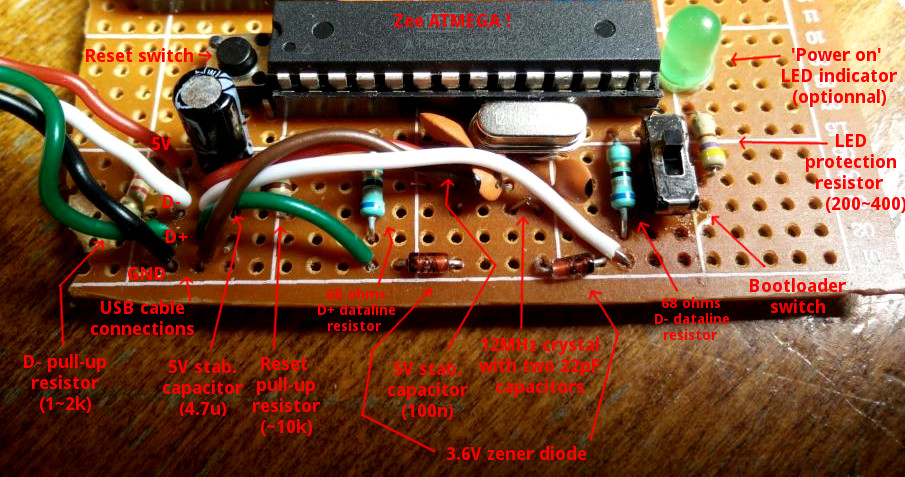

Custom Midi Controller
======================

Code and instructions to easily build a MIDI Controller from scratch using a
standalone Atmega328P-PU, but still use the Arduino library for the convenient 
functions.

Features
--------

- Cheap to build : use directly a standalone Atmega microcontroller (not a whole Arduino board) ;
- Plug-and-play : detected as an actual MIDI device automatically (no need for intermediate software) ;
- Easy reprogram through USB : using the proper bootloader and a switch, you enter a mode to reprogram it at will (no need for USB to Serial  / FTDI stuff) ;
- Use the Arduino library to manage pins with pinMode, digitalRead, analogRead... *Please no crazy batshit using binary operators - who actually wants to code like that, really ?*
- Easily customizable, extandable.

How to build your MIDI Controller ?
-----------------------------------

1. General overview
2. Shopping for hardware
3. Making a USB cable
4. Building the core (standalone Atmega on USB)
5. Flashing the USBasp/V-USB bootloader
6. Flashing a dummy Midi Controller firmware
7. Adding switches and potentiometer
8. Put all this in a nice case
9. Profit !

1. General overview
-------------------


2. Shopping for hardware
------------------------

### The core

- 1 x Atmega328P-PU                ([Product on Farnell](http://fr.farnell.com/webapp/wcs/stores/servlet/Search?mfpn=1715487) Careful : need *exactly* ths 328**P-PU**
- 1 x Socket for 28 pin chip       ([Product on Farnell]) Optionnal, but recommended
- 1 x USB connector                ([Product on Farnell](http://fr.farnell.com/webapp/wcs/stores/servlet/Search?mfpn=1696544)) (or an old USB cable with male plug, to be cut to access the wires)
- 1 x 12MHz crystal                ([Product on Farnell](http://fr.farnell.com/webapp/wcs/stores/servlet/Search?mfpn=2508453))
- 2 x 3.6V zener diode             ([Product on Farnell](http://fr.farnell.com/webapp/wcs/stores/servlet/Search?mfpn=1861480))
- 2 x 22pF ceramic capacitor       ([Product on Farnell](http://fr.farnell.com/webapp/wcs/stores/servlet/Search?mfpn=9411674))
- 1 x 100nF ceramic capacitor      ([Product on Farnell](http://fr.farnell.com/webapp/wcs/stores/servlet/Search?mfpn=9411887))
- 1 x 4.7μF electrolytic capacitor ([Product on Farnell](http://fr.farnell.com/webapp/wcs/stores/servlet/Search?mfpn=9451471))
- 1 x 1.5kΩ resistor               ([Product on Farnell](http://fr.farnell.com/webapp/wcs/stores/servlet/Search?mfpn=)) TODO (or 1k, 2k ...)
- 2 x 68Ω resistor                 ([Product on Farnell](http://fr.farnell.com/webapp/wcs/stores/servlet/Search?mfpn=)) TODO
- 2 x mini push button switch      ([Product on Farnell](http://fr.farnell.com/webapp/wcs/stores/servlet/Search?mfpn=)) TODO
- Colored wires                    such as [this](http://www.robotshop.com/eu/en/elenco-22-gauge-black-25-ft.html), or any cable you can find. Just don't use fancy jumper wires if you intend to solder !
- Single-sided prototyping board   ([example](http://www.robotshop.com/eu/en/prototyping-board.html))

### Actual controller stuff

- ? x On/off switches                   ([Product on Farnell](http://fr.farnell.com/webapp/wcs/stores/servlet/Search?mfpn=)) TODO
- ? x Push-button / keys                ([Product on Farnell](http://fr.farnell.com/webapp/wcs/stores/servlet/Search?mfpn=)) TODO
- ? x Rotatory potentiometers           ([Product on Farnell](http://fr.farnell.com/webapp/wcs/stores/servlet/Search?mfpn=1760794))
- ? x Knob for rotatory potentiometers  ([Product on Farnell](http://fr.farnell.com/webapp/wcs/stores/servlet/Search?mfpn=2473099))
- ? x Linear potentiometers ("sliders") ([Product on Farnell](http://fr.farnell.com/webapp/wcs/stores/servlet/Search?mfpn=1688411))
- ? x Cursor for linear potentiometers  ([Product on Farnell](http://fr.farnell.com/webapp/wcs/stores/servlet/Search?mfpn=1440016))

### Tools

- Soldering iron (+solder material) ;
- Stripper ;
- Some scissors or small cutters to cut wires after soldering ;
- Ideally, a multimeter - or at least to check there's no short between GND and 5V !
- A small knife if you need to remove the chip from the support.

### Optional (if you aim to control more than 6 analog entries, i.e. potentiometers) :

- ? x 1-to-8 analog multiplexer         ([Product on Farnell](http://fr.farnell.com/webapp/wcs/stores/servlet/Search?mfpn=1236279))
- ? x Socket for 16 pin chip            ([Product on Farnell]) Optionnal, but recommended

3. Making a USB cable
---------------------


4. Building the core (standalone Atmega on USB)
-----------------------------------------------




5. Flashing the USBasp/V-USB bootloader
---------------------------------------

For the ATMEGA to be able to communicate directly through the USB (allowing it
to be recognized as a USB device and to reprogram it at will), we use a custom
bootloader from V-USB. The bootloader is the small piece of software, pretty
similar to the BIOS in computer, which initiates the rest of the software meant
to be run. 

In our case, if the "bootloader switch" is activated when the ATMEGA boot, it will
emulate a "USBasp" programmer and you'll be able to upload to change the program. 
If the "bootloader switch" is in the other position, the bootloader will launch
the program you uploaded on the ATMEGA - which can be as simple as blinking a LED,
or acting as a USB device (mouse, keyboard, MIDI, ...).

Flashing the bootloader is a sort of egg-and-chicken situation : to flash the
chip for the first time, you need another chip. This can be done for instance
using a Arduino UNO board. Fortunately, this is done once and for all, assuming 
the flashing is succesful ! The bootloader flashing setup is the following :


Once this setup is ready, you should flash a particular program "ArduinoISP"
(in-situ programming) on the Arduino board. It is available in the Arduino IDE
under File > Examples. Then you need to switch the Programmer in the IDE to
"Arduino as ISP" (Tools > Programmer > Arduino as ISP).

If we wanted to flash the regular Arduino bootloader, we would now go to Tools >
Flash bootloader. However, we want to flash our particular V-USB bootloader.
Therefore, we use the Makefile in this directory to do so :

```
# Compile
make bootloader
# Flash
make bootloader-flash
```

Once this is done, you should put back your Atmega on your board and test if it
worked. To do so, you can set your board in "Bootloader mode ON". In a terminal,
type :

```
dmesg -e -w
```

to display new messages from the kernel. Plug your board in. If it's working,
you should see some blabbling about a new USB device called USBasp (meaning it's
recognized as a USB chip programmer).

6. Flashing a dummy Midi Controller firmware
--------------------------------------------

7. Adding switches and potentiometers
-------------------------------------

8. Put all this in a nice case
------------------------------

[MakerCase](http://www.makercase.com/)


9. Profit !
-----------

References, inspiration, credits, links
---------------------------------------

- USBaspLoader https://github.com/baerwolf/USBaspLoader
- V-USB https://www.obdev.at/products/vusb/index.html

- USnooBie kit http://www.eleccelerator.com/usnoobie/index.php
- More on USnooBie kit http://wiki.seeedstudio.com/wiki/Usnoobie_Kit

- http://www.instructables.com/id/Custom-Arduino-MIDI-Controller/?ALLSTEPS
- http://www.instructables.com/id/USB-MIDI-Controller/?ALLSTEPS

- http://codeandlife.com/2012/01/22/avr-attiny-usb-tutorial-part-1/

