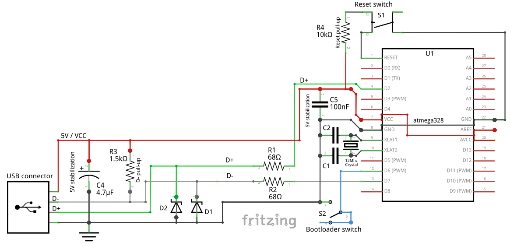

Custom Midi Controller
======================

Code and instructions to easily build a MIDI Controller from scratch using a
standalone Atmega328P-PU, but still use the Arduino library for the convenient 
functions.

Features
--------

- Cheap to build : use directly a standalone Atmega microcontroller (not a whole Arduino board) ;
- Plug-and-play : detected as an actual MIDI device automatically (no need for
  intermediate software) ;
- Easy reprogram through USB : using the proper bootloader and a switch, you enter a
  mode to reprogram it at will ;
- Use the Arduino library to manage pins with pinMode, digitalRead, analogRead... Please no crazy batshit using binary operators.
- Easily customizable, extandable ;

How to build your MIDI Controller ?
-----------------------------------

1. General overview and requirements
2. Shopping for hardware
3. Building the core (standalone Atmega on USB)
4. Flashing the USBasp/V-USB bootloader
5. Flashing a dummy Midi Controller firmware
6. Adding switches and potentiometer
7. Put all this in a nice case
8. Profit !

1. General overview and requirements
------------------------------------

2. Shopping for hardware
------------------------

The core :

- 1 x Atmega328P-PU                ([Product on Farnell](http://fr.farnell.com/webapp/wcs/stores/servlet/Search?mfpn=1715487)
- 1 x USB connector                ([Product on Farnell](http://fr.farnell.com/webapp/wcs/stores/servlet/Search?mfpn=1696544))
- 1 x 12MHz crystal                ([Product on Farnell](http://fr.farnell.com/webapp/wcs/stores/servlet/Search?mfpn=2508453))
- 2 x 3.6V zener diode             ([Product on Farnell](http://fr.farnell.com/webapp/wcs/stores/servlet/Search?mfpn=1861480))
- 2 x 22pF ceramic capacitor       ([Product on Farnell](http://fr.farnell.com/webapp/wcs/stores/servlet/Search?mfpn=9411674))
- 1 x 100nF ceramic capacitor      ([Product on Farnell](http://fr.farnell.com/webapp/wcs/stores/servlet/Search?mfpn=9411887))
- 1 x 4.7μF electrolytic capacitor ([Product on Farnell](http://fr.farnell.com/webapp/wcs/stores/servlet/Search?mfpn=9451471))
- 1 x 1.5kΩ resistor               ([Product on Farnell](http://fr.farnell.com/webapp/wcs/stores/servlet/Search?mfpn=)) TODO
- 2 x 68Ω resistor                 ([Product on Farnell](http://fr.farnell.com/webapp/wcs/stores/servlet/Search?mfpn=)) TODO
- 2 x mini push button switch      ([Product on Farnell](http://fr.farnell.com/webapp/wcs/stores/servlet/Search?mfpn=)) TODO

Actual controller stuff :

- ? x Switches / keys                   ([Product on Farnell](http://fr.farnell.com/webapp/wcs/stores/servlet/Search?mfpn=)) TODO
- ? x Rotatory potentiometers           ([Product on Farnell](http://fr.farnell.com/webapp/wcs/stores/servlet/Search?mfpn=1760794))
- ? x Knob for rotatory potentiometers  ([Product on Farnell](http://fr.farnell.com/webapp/wcs/stores/servlet/Search?mfpn=2473099))
- ? x Linear potentiometers ("sliders") ([Product on Farnell](http://fr.farnell.com/webapp/wcs/stores/servlet/Search?mfpn=1688411))
- ? x Cursor for linear potentiometers  ([Product on Farnell](http://fr.farnell.com/webapp/wcs/stores/servlet/Search?mfpn=1440016))

Optional (if you aim to control more than 6 analog entries, i.e. potentiometers) :

- ? x Analogic multiplexer              ([Product on Farnell](http://fr.farnell.com/webapp/wcs/stores/servlet/Search?mfpn=1236279))

3. Building the core (standalone Atmega on USB)
-----------------------------------------------

4. Flashing the USBasp/V-USB bootloader
---------------------------------------

5. Flashing a dummy Midi Controller firmware
--------------------------------------------

6. Adding switches and potentiometers
-------------------------------------

7. Put all this in a nice case
------------------------------

8. Profit !
-----------

References, inspiration, credits, links
---------------------------------------

- USBaspLoader https://github.com/baerwolf/USBaspLoader
- V-USB https://www.obdev.at/products/vusb/index.html

- USnooBie kit http://www.eleccelerator.com/usnoobie/index.php
- More on USnooBie kit http://wiki.seeedstudio.com/wiki/Usnoobie_Kit

- http://www.instructables.com/id/Custom-Arduino-MIDI-Controller/?ALLSTEPS
- http://www.instructables.com/id/USB-MIDI-Controller/?ALLSTEPS

- http://codeandlife.com/2012/01/22/avr-attiny-usb-tutorial-part-1/

